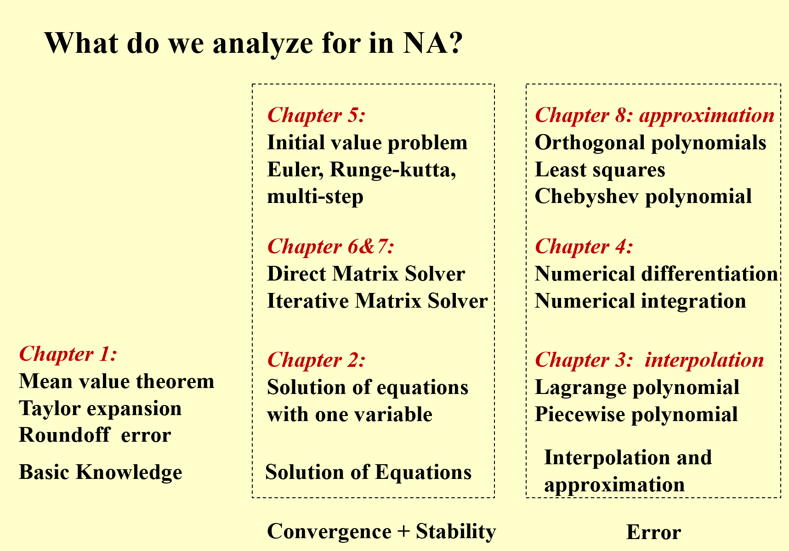
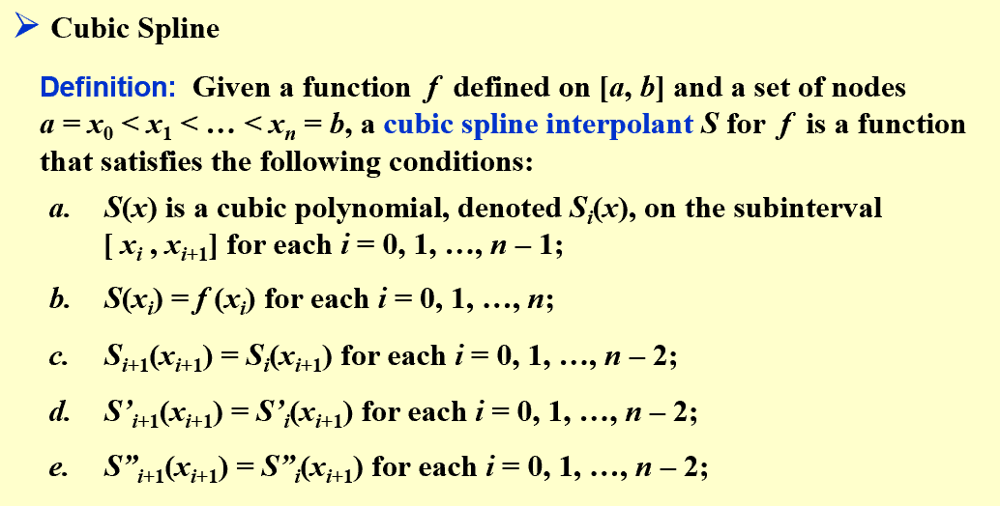
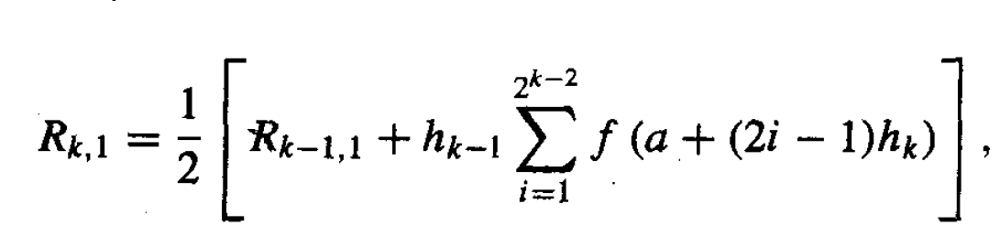
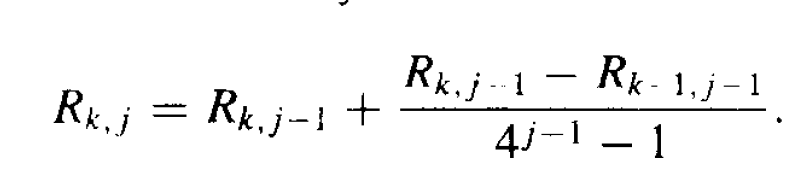
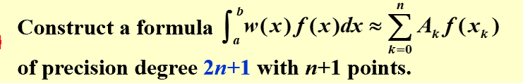
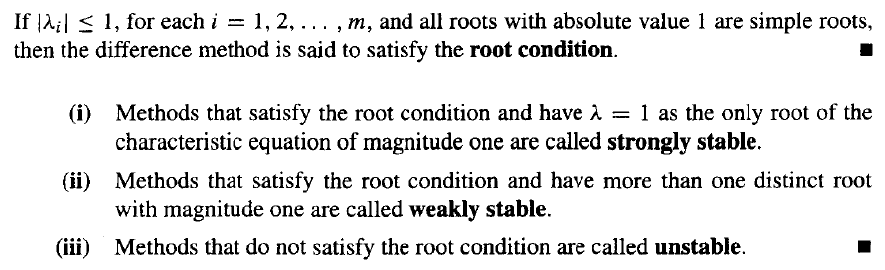

---
title: NAoutlines
date: 2024-10-09 21:10:03
tags: numerical analysis
mathjax: true
---
> 说明，本笔记为NA（23秋冬数值分析）课程的总结笔记，包含了整个课程的总体内容介绍，比较浅层；

# The Outline of Numerical Analysis

## Chapter 1

### error

- truncation error
- roundoff error

### stability

- stable & unstable & conditionally stable

## Chapter 2 Solution of Equations in One Variable

### important method

- the bisection method
  - **algorithm: Bisection**
- fiexd-point iteration
  - **algorithm:Fixed-point Iteration**
- Newton's method
  - the variants of Newton's method
    - **algorithm:Secant**
    - **algorithm: Method of False Position**

### Error analysis for iterative methods

- Newton's method is at least quadratically convergent

### Accelerating Convergence

- **algorithm: Aitken's $\Delta^{2}$ Method**
- **algorithm: Steffensen's Method**

## Chapter 6 Direct Methods for Solving Linea systems

### Gaussian Elimination-backward substitution

- **algorithm: Gaussian elimination-backward substitution**
- number of computation

### Pivoting Strategies

- partial pivoting
- scaled partial pivoting
- complete pivoting

### Matrix Factorization

- LU factorization
  - **algorithm: LU factorization**
- Doolittle's method

### special types of matrices

- Positive definite matrix and Choleski's method
  - **algorithm: Choleski's method(LDL^t^ factorization)**
- Crout factorization and tridiagonal linear system
  - **algorithm: Crout factorization**

## Chapter 7 Iterative Techniques in Matrix Algebra

### norms of vectors and matrices

- natural norm

### eigenvalues and eigenvectors

- spectral radius

### iterative techniques for solving linear systems

- **Jacobi iterative method**

  - **algorithm: Jacobi Iterative Method**
- **Gauss-Seidel Iterative Method**

  - **algorithm: Gauss-Seidel Iterative Method**
- convergence of iterative method
- relaxation methods

  - **algorithm : SOR**

### error bounds and iterative refinement

- condition number $K(A)=||A||\cdot||A^{-1}|| $

## Chapter 9 Approximating Eigenvalues

### the power method

- **algorithm: Power Method**
- rate of convergence

### the Inverse Power Method

- **algorithm: Inverse Power Method**
- can be used to **find a better approximation** with an initial approximation of **certain eigenvalue**
  - or get an approximation of certain eigenvalue from eigen vectors by $\frac{\mathbf{x^{t}Ax}}{\mathbf{x^t x}}$

## Chapter 3 Interpolation and Polynomial Approximation

### Lagrange Polynomial

- $P_n(x)=\sum_{i=0}^{n} L_{n,i}(x)y_i$
- $L_{n,i}(x)=\prod_{j\ne i,j=0}^{n}\frac{(x-x_j)}{(x_i-x_j)}$
- truncation error $R(x)$
- "the Lagrange polynomial is unique"

### Neville's Method

- to avoid $L_{n,i}(x)$ re-calculated

### Divided Differences

- $f[x_0,...,x_k]$

### Newton's Interpolation

- $N_n(x)=a_0+a_1(x-x_0)+a_2(x-x_0)(x-x_1)+...+a_n(x-x_0)...(x-x_{m-1})$
  - $a_i = f[x_0,...,x_i]$

### Equal Spacing and Differences

- forward difference and backward difference
- Newton's forward-difference formula
- Newton's backward-difference formula

### Hermite Interpolation

- Osculating polynomials
  - agrees with $f$ and all its derivative of order $\le m_i$ at one point $x_i$
  - and it's just the Taylor polynomial at $x_i$
- Hermite polynomials
  - the case of osculating polynomials when $m_i =1$ for each $i=0,1,...,n$
  - 注意构建的方式

### Cubic Spline Interpolation

- piecewise linear interpolation

  - trial 1: use lagrange polynomial at each subinterval
    - **no longer smooth** at each point
  - trial 2: Hermite piecewise interpolation
    - not easy to **obtain so many derivatives**
- Cubic Spline(degree-3)

  

  - the general version:
    - $S_j(x) = a_j+b_j(x-x_j)+c_j(x-x_j)^2+d_j(x-x_j)^3,\quad x \in [x_j,x_{j+1}]$
    - $h_j=x_{j+1}-x_j$
    - $\{a_n\},\{b_n\},\{d_n\}$ can all be represented by  $\{c_n\}$, and $\{c_n\}$ can be solved by constructing a linear system with the conditions described above.[normally, a **Crout factorization** is used]
- **algorithm：Cubic Spline Interpolation**
- Boundary

  - clamped boundary
    - $S'(x_0)=y'_0,S'(x_n)=y'_n$
  - free boundary
    - $S''(x_0)=S''(x_n)=0$	**[ Natural Spline ]**

## Chapter 8 Approximation Theory

### Discrete Least Squares Approximation[离散最小二乘近似]

- constructing *normal equations* (which has a unique solution provided that $x_i$ are distinct)

  - the solution ${a_n}$ is the constants of polynomial that best fits $f(x)$ with **Least-Squares method**
- variants of the least-square approximation polynomial

  - **Linearization**

### Orthogonal Polynomial and Least Squares[最小二乘和正交多项式]

- linearly independent and **generalized polynomial**
- the **weighted function** (discrete type & continuous  type)
- the **general least square approximation problem** (discrete type & continous type)
- **Inner product**-----$(f,g)$

  - normal equations
- **orthogonal polynomials**

  - normal equations with orthogonalizing
- **algorithm: orthogonal polynomial approximation**

### Chebyshev Polynomials and Economization of Power Series

#### chebyshev polynomials

- minimize $||P-y||_{\infin}$
- Chebyshev Theorem
- **Chebyshev Polynomials**

  - $T_n(x)=\cos{n\theta}=\cos(n\cdot \arccos{x})$
  - recurrence relation:
    - $T_0(x)=1,T_1(x)=x,T_{n+1}(x)=2xT_n(x)-T_{n-1}(x)$
  - $T_i(x)$ are orthogonal on $[-1,1]$ with respect to the weight function $w(x)=\frac{1}{\sqrt{1-x^2}}$
  - the error

#### Economization of Power Series

- in an approximation, to reduce the degeree of polynomial with a **minimal loss of accuracy**

## Chapter 4 Numerical Differentiation and Integration

### Numerical Differentiation

- three-point formulae
- five-point formulae
- differentiation based on Taylor expansion

### Elements of Numerical Integration

- **degree of accuracy/precision**
- integrate the **Lagrange interpolating polynomial**

  - for equally spaced nodes , we can form ***Newton-Cotes formulae***
    - **Cotes coefficients **$C_i^{(n)}$
      - $n=1$, **Trapezoidal Rule**	precision=1
      - $n=2$, **Simpson's Rule**     precision=3
      - $n=3$, **Simpson's 3/8-Rule**    precision=3
      - $n=4$, **Cotes' Rule**      precision=5

### Composite Numerical Integration

> *piecewise* interpolation applied to low-order *Newton-Cotes formulae* to reduce the oscillatory of high-degree polynomials

- **Composite Trapezoidal Rule**
- **Composite Simpson's Rule**
- composite integration techniques are all *stable*
- and normally the composite intergation using equally spaced nodes

### Romberg Integration

- Romberg sequence
- **algorithm: Romberg Method**

### Richardson's Extrapolation

- generate high-accuracy results while using low-order formulaes
- $T_m(h)=\frac{2^mT_{m-1}(\frac{h}{2})-T_{m-1}{h}}{2^m-1}$

### Adaptive Quadrature Methods

- predict the amount of functional variation and adapt the step size to the varying requirements
  - one adaptive method based on Composite Simpson's rule

### Gaussian Quadrature

> use orthogonal polynomials to approximate the integration

- the original way of computing the constants $A_k$ and $x_k$
- using orthogonal polynomials to find Gaussian points(the roots)
- spacial family of orthogonal functions

  - Legendre Polynomials $\Rightarrow$ *Gauss-Legendre* quadrature formulae
  - Chebysheve Polynomials $\Rightarrow$ *Gauss-Chebyshev* quadrature formulae

## Chapter 5 Initial-Value Problems for Ordinary Differential Equations (ODE初值问题)

### the Elementary Theory of Initial-Value Problems

- unique solution
- Lipschitz condition

### Euler's Method

- Euler's explicit(default version)
- Euler's implicit (stable)

### other Euler's Method

- Trapezoidal Method**(implicit)**     truncation error: $O(h^2)$
- Double-step Method    truncation error: $O(h^2)$
- modified Euler's Method

### Higher Order Taylor Methods

- **local truncation error**
- Taylor method of order $n$
  - $T^{(n)}(t_i,w_i)$
  - local truncation error is $O(h^n)$

### Runge-Kutta Methods

- Midpoint Method, Modified Euler Method, Heun's Method are all **Runge-Kutta Method of order 2**
- the most popular one: **Classical Runge-Kutta Order 4 Method**
- relationship between the number of evaluations per step and the order of the local truncation error

### Multistep Methods

> **two ways** to derive the same multistep method formulae

$w_{i+1}=a_{m-1}w_i+a_{m-2}w_{i-1}+...+a_0w_{i+1-m}+h(b_mf_{i+1}+b_{m-1}f_i+...+b_0f_{i+1-m})$

implicit when $b_m\ne0$, explicit when $b_m=0$

#### Classical multistep method

- **Adams-Bashforth explicit $m$-step technique **
- **Adams-Moulton implicit $m$-step technique **
- **Adams predictor-corrector system** (the most popular version is all 4^th^-order)
  - Compute first $m$ values by ***Runge-Kutta*** method
  - Predict by ***Adams-Bashforth explicit*** method
  - Correct by ***Adams-Moulton implicit*** method
- **algorithm: Adams Fourth-Order Predictor-Corrector**

#### Derive from integration

- change the right part of **Euler's method** into integration of $f$
- using *Newton's backward-difference* formulae to construct a $P(t)$
- for equally spaced points, we can calculate the integration of each term's coefficient and get the latter part in *multistep method formlae*

#### Derive from Taylor Expansion

- $y_{i-m}$: $y_i$'s Taylor expansion
- $f_{i-m}:$ $y'_i$'s Taylor expansion
- 因为展开式联立得到的multistep formulae中仍有系数不固定，所以根据对这些系数的选择我们能得到不同的multistep method
  - ***Adams-Bashforth explicit*** method ($a_0=a_1=0$)
  - ***Adams-Moulton implicit*** method (replace $f_{i-1}$ by $f_{i+1}$ and $a_0=a_1=0$)
  - **Milne's** method (replace $f_{i-3}$ by $w_{i-3}$)
  - **Simpson's implicit** method ($a_0=0 $ and $a_1=1$)

### Higher-Order Equations and Systems of Differential Equations

- transform into a system of 1^st^-order differential equations

### Stability

- consistent & convergent
- test equation ($y'=\lambda y$, $H=\lambda h$)
- region of absolute stability

#### root condition

- characteristic equation(or matrix)
  - the root condition is a judgement by the eigenvalue of the characteristic eqautions
- 
